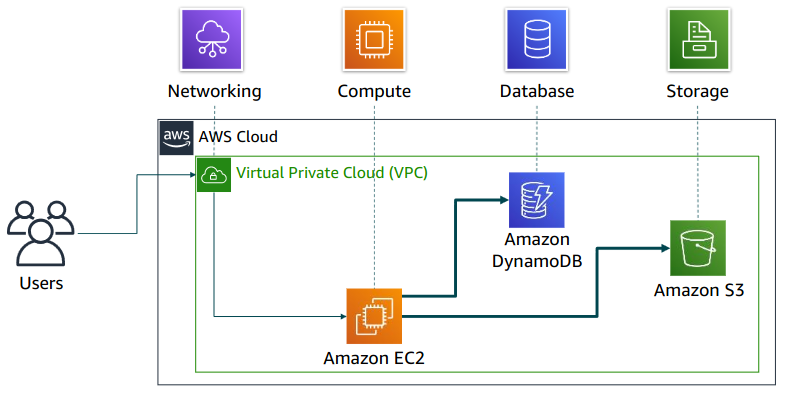

### Section 3: Introduction to Amazon Web Services (AWS)

#### AWS
AWS is a secure cloud platform that provides a wide range of global cloud-based products, including compute, storage, networking, databases, and management tools. It offers flexibility, allowing users to access resources on-demand and pay only for the services they use. AWS services work together like building blocks, enabling businesses to create scalable and efficient solutions tailored to their needs.

#### Categories of AWS services
- Compute: Services that provide processing power for applications. Examples include Amazon EC2 (Elastic Compute Cloud), AWS Lambda (serverless computing), and Amazon ECS (Elastic Container Service).

- Storage: Solutions for data storage and backup. Examples include Amazon S3 (Simple Storage Service), Amazon EBS (Elastic Block Store), and Amazon Glacier (cold storage).

- Databases: Managed database services for relational and non-relational data. Examples include Amazon RDS (Relational Database Service), Amazon DynamoDB (NoSQL database), and Amazon Aurora (MySQL and PostgreSQL compatible).

- Networking: Services that enhance connectivity and security. Examples include Amazon VPC (Virtual Private Cloud), Amazon Route 53 (DNS service), and AWS Direct Connect (dedicated network connection).

- Security, Identity, and Compliance: Tools for managing security and compliance. Examples include AWS IAM (Identity and Access Management), AWS KMS (Key Management Service), and AWS Shield (DDoS protection).

- Machine Learning and AI: Services for building and deploying machine learning models. Examples include Amazon SageMaker (ML model training and deployment) and AWS Rekognition (image and video analysis).

- Analytics: Tools for data analysis and visualization. Examples include Amazon Redshift (data warehousing), AWS Glue (ETL service), and Amazon Athena (querying data in S3).

- Developer Tools: Services to assist developers in building and deploying applications. Examples include AWS CodePipeline (CI/CD service) and AWS CloudFormation (infrastructure as code).

- Management and Governance: Tools for monitoring and managing AWS resources. Examples include AWS CloudTrail (logging), AWS CloudWatch (monitoring), and AWS Config (resource tracking).

- Application Integration: Services that enable integration between different applications. Examples include Amazon SQS (Simple Queue Service) and AWS Step Functions (orchestration service).

- Internet of Things (IoT): Services for connecting and managing IoT devices. Examples include AWS IoT Core and AWS IoT Greengrass.

#### Simple solution example

#### Choosing a service
- Amazon EC2(https://aws.amazon.com/ec2/): You want complete control over our AWS computing resources.
- AWS Lambda (https://aws.amazon.com/lambda/): You want to run your code and not manage or provision servers.
- AWS Elastic Beanstalk (https://aws.amazon.com/elasticbeanstalk/): You want a service that deploys, manages, and scales your web applications for you.
- Amazon Lightsail(https://aws.amazon.com/lightsail/): You need a lightweight cloud platform for a simple web application.
- AWS Batch (https://aws.amazon.com/batch/): You need to run hundreds of thousands of batch workloads.
- AWS Outposts (https://aws.amazon.com/outposts/): You want to run AWS infrastructure in your on-premises data center.
- Amazon Elastic Container Service (Amazon ECS) (https://aws.amazon.com/cs/)
- Amazon Elastic Kubernetes Service (Amazon EKS ) (https://aws.amazon.com/eks/)
- AWS Fargate(https://aws.amazon.com/fargate/): You want to implement a containers or microservices architecture.
- VMware Cloud on AWS (https://aws.amazon.com/vmware/): You have an on-premises server virtualization platform that you want to migrate to AWS.

#### Three ways to interact with AWS
- AWS Management Console: 
The console provides a rich graphical interface to a majority of 
the features offered by AWS. (Note: From time to time, new features might not have all of 
their capabilities included in the console when the feature initially launches.)
- AWS Command Line Interface (AWS CLI): 
The AWS CLI provides a suite of utilities that can be 
launched from a command script in Linux, macOS, or Microsoft Windows.
- Software development kits (SDKs): 
AWS provides packages that enable accessing AWS in a 
variety of popular programming languages. This makes it easy to use AWS in your existing 
applications and it also enables you to create applications that deploy and monitor complex 
systems entirely through code. 

