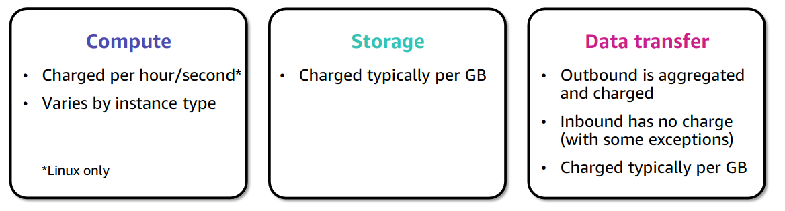

### Section 1: Pricing 

#### Pricing models
#### Three fundamental drivers of cost with AWS

* **Compute**: Charged per hour/second\* (Linux only). Varies by instance type.
* **Storage**: Charged typically per GB.
* **Data transfer**: Outbound is aggregated and charged. Inbound has no charge (with some exceptions). Charged typically per GB.

### How do you pay for AWS?
- **Pay for what you use**
  - You only pay for the resources you use, no more, no less.
- **Pay less when you reserve**
  - If you need a resource for a long time, you can usually get a discount by reserving it.
- **Pay less when you use more**
  - If you use a lot of a resource, you can usually get a discount by using more.
- **Pay even less as AWS grows**
  - AWS reduces the price of resources as it grows capacity and improves efficiency.

### AWS Free Tier

Enables you to gain free handson experience with the AWS platform, products, and services. Free for 1 year for new customers

The AWS Free Tier applies to certain services and options. 
For new AWS customer,
- Amazon Elastic Compute Cloud (Amazon EC2) T2 micro instance
- Amazon Simple Storage Service (Amazon S3), 
- Amazon Elastic Block Store (Amazon EBS)
- Amazon Elastic Load Balancing, 
- AWS data transfer

### Services with no charge
- Amazon Virtual Private Cloud (Amazon VPC): VPCs are a virtual network that allows you to create and manage network infrastructure on AWS.
- AWS Identity and Access Management (IAM): IAM controls your users’ access to AWS services and 
resources.
- AWS CloudFormation: CloudFormation enables you to create and manage AWS resources.
- Consolidated Billing: Consolidated billing enables you to pay for AWS services and resources. 
    - One bill for multiple accounts
    - The ability to easily track each account’s charges.
    - Volume pricing discounts: The opportunity to decrease charges as a result of volume pricing discounts from combined usage

- Automatic Scaling: Automatic scaling allows you to scale AWS resources based on demand.
- AWS OpsWorks is an application management service that makes it easy to deploy and 
operate applications of all shapes and sizes
