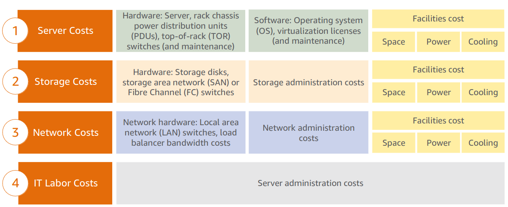

### Section 2: Total Cost of Ownership

#### On-premises versus cloud
- **On-Premises** is best for organizations requiring full control, customizability, and consistent workloads, but it comes with higher upfront costs and slower scalability.
- **Cloud** AWS offers flexibility, scalability, and lower upfront costs, making it ideal for dynamic workloads and organizations seeking agility and innovation, though it requires diligent cost management and may have limitations in control and compliance

#### Total Cost of Ownership (TCO)
Total Cost of Ownership (TCO) is the financial estimate to help identify direct and indirect 
costs of a system.

To compare the costs of running an entire infrastructure environment or specific workload onpremises versus on AWS

- Costs that are associated with data center management include:
    - Server costs for both hardware and software, and facilities costs to house the equipment. 
    - Storage costs for the hardware, administration, and facilities. 
    - Network costs for hardware, administration, and facilities. 
    - IT labor costs that are required to administer the entire solution. 

#### AWS Pricing Calculator [Calculate Cost](https://www.openai.com)
Use the AWS Pricing Calculator to:
- Estimate monthly costs
- Identify opportunities to reduce monthly costs
- Model your solutions before building them
- Explore price points and calculations     behind your estimate
- Find the available instance types and contract terms that meet your needs
- Name your estimate and create and name groups of services

#### [Estimate from here](https://calculator.aws/#/createCalculator/ec2-enhancement)

