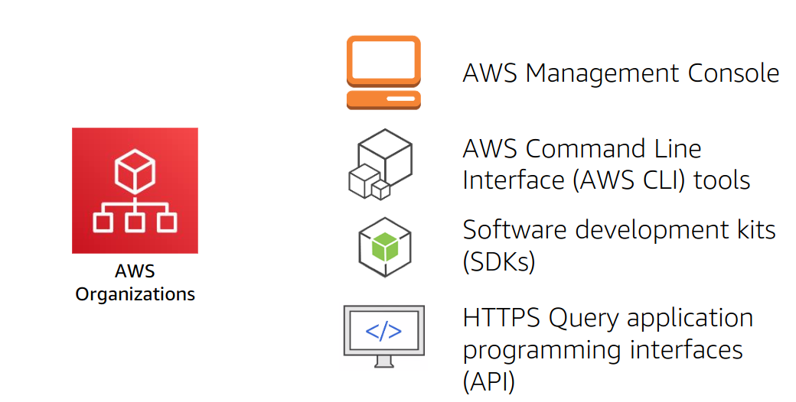

### Section-3 
AWS Organizations is a free account management service that enables you to consolidate multiple AWS accounts into an organization that you create and centrally manage.
The main benefits of AWS Organizations are:
* Centrally managed access policies across multiple AWS accounts.
* Controlled access to AWS services.
* Automated AWS account creation and management.
* Consolidated billing across multiple AWS accounts.

#### Terminology

*OU=Organizational Unit

### Key features and benifits
- Policy-based Account Management: Centrally manage and enforce policies across multiple AWS accounts, ensuring compliance and security.

- Group-based Account Management: Organize accounts into groups for streamlined management and apply policies at the group level for easier administration.

- Application Programming Interfaces (APIs): Automate account management tasks using APIs, enabling integration with existing systems and reducing manual efforts.

- Consolidated Billing: Simplify financial management by combining multiple accounts into a single billing statement, offering greater visibility and cost optimization across the organization.  

### Limits of AWS Organizations

### Accessing AWS Organizations

